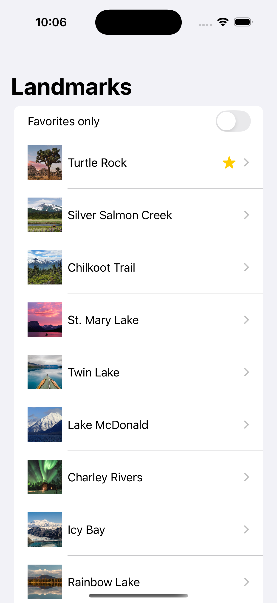
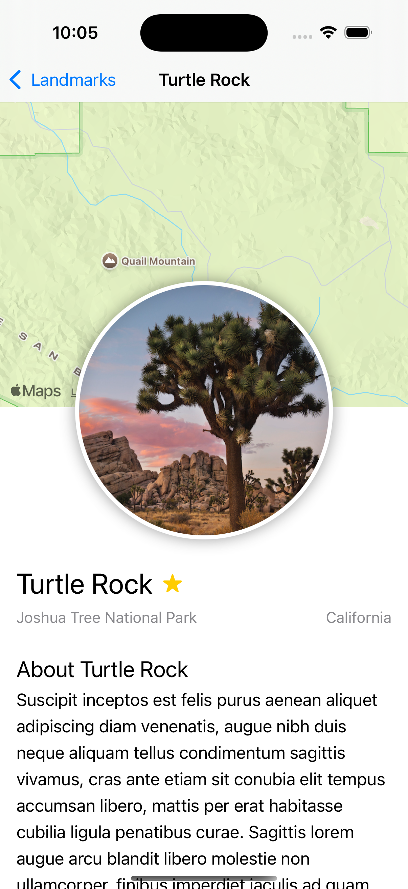
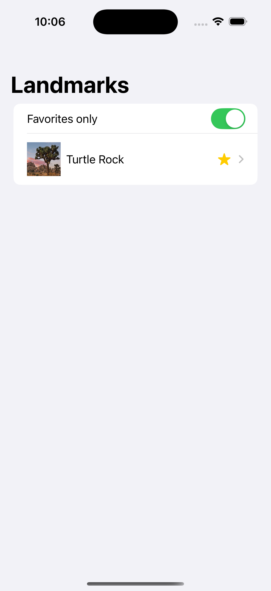

# Landmarks

SwiftUI Landmarks is a demo project that showcases the SwiftUI framework and its features. The project is based on
the [Apple SwiftUI tutorial](https://developer.apple.com/tutorials/swiftui).

### Screenshots

    
    
    
    

### Features
- List of landmarks
- Detail view for each landmark
- Set favorite landmarks